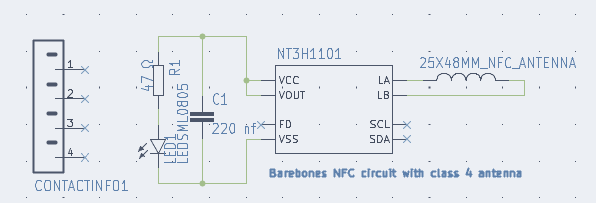

# NFC Enabled PCB Business Card

This is the ultimate business card in PCB form, designed to bridge the physical world with the digital. The front of the card has an NFC chip designed to hold enough information to store your contact info, url, email, and plain text. Energy is harvested during a scan through the antenna and powers the LED. 

On the back of the card is a QR code designed to act as backup for the NFC card in case you choose to have the NFC unpopulated. The back provides written contact info for a quick visual reference, allowing you to make a quick first impression.

A good business card provides a perfect opportunity to impress a potential contact. It needs to stand out, and with this design it will not only stand out, but will also act as a phone stand. Perfect for those long airplane commutes.

## Components

- NFC chip 1kb XQFN-8 NT3H11W0FHKH
- LED SMD 0805
- 47R Resistor SMD 0603
- 220nF Capacitor SMD 0603

## NFC Antenna

NFC antenna is an open source class 4 attena design from [NXP](https://www.themobileknowledge.com/wp-content/uploads/2018/07/02-Webinar-slies-Antenna-design-for-NTAG-I2C-plus.pdf)
- Antenna loop is 2.75 uH
- Energy harvesting output VOUT is used to power the NFC chip connected to VCC pin.

## Production Samples

 
